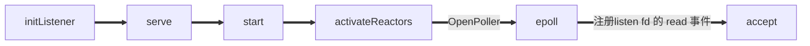
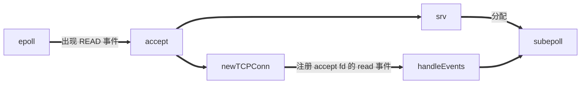
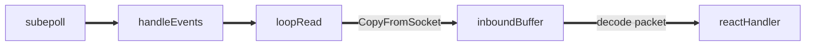
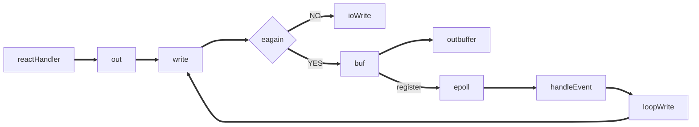

## ACCEPT 实现细节

#### net/fd_unix.go

```go
// 获取一个新连接
func (fd *netFD) accept() (netfd *netFD, err error) {
   // 获取一个 文件描述符
   d, rsa, errcall, err := fd.pfd.Accept()
   if err != nil {
      if errcall != "" {
         err = wrapSyscallError(errcall, err)
      }
      return nil, err
   }
   // 构建 连接的 NETFD 用于连接读
   if netfd, err = newFD(d, fd.family, fd.sotype, fd.net); err != nil {
      poll.CloseFunc(d)
      return nil, err
   }
   if err = netfd.init(); err != nil {
      netfd.Close()
      return nil, err
   }
   lsa, _ := syscall.Getsockname(netfd.pfd.Sysfd)
   netfd.setAddr(netfd.addrFunc()(lsa), netfd.addrFunc()(rsa))
   return netfd, nil
}
```

#### internal/poll/fd_unix.go

```go
// Accept wraps the accept network call.
func (fd *FD) Accept() (int, syscall.Sockaddr, string, error) {
   if err := fd.readLock(); err != nil {
      return -1, nil, "", err
   }
   defer fd.readUnlock()

   if err := fd.pd.prepareRead(fd.isFile); err != nil {
      return -1, nil, "", err
   }
   for {
      // 触发一次系统调用，获取 socket
      s, rsa, errcall, err := accept(fd.Sysfd)
      if err == nil {
         return s, rsa, "", err
      }
      switch err {
      case syscall.EINTR:
         continue
      case syscall.EAGAIN:
         // 如果这时 socket 还不可读，则 park 当前 goroutine
         if fd.pd.pollable() {
            if err = fd.pd.waitRead(fd.isFile); err == nil {
               continue
            }
         }
      case syscall.ECONNABORTED:
         // This means that a socket on the listen
         // queue was closed before we Accept()ed it;
         // it's a silly error, so try again.
         continue
      }
      return -1, nil, errcall, err
   }
}
```

#### 从 **waitRead** 可以跳转到 runtime/netpoll.go

```go
// returns true if IO is ready, or false if timedout or closed
// waitio - wait only for completed IO, ignore errors
func netpollblock(pd *pollDesc, mode int32, waitio bool) bool {
   gpp := &pd.rg
   if mode == 'w' {
      gpp = &pd.wg
   }

   // set the gpp semaphore to pdWait
   for {
      old := *gpp
      if old == pdReady {
         *gpp = 0
         return true
      }
      if old != 0 {
         throw("runtime: double wait")
      }
      if atomic.Casuintptr(gpp, 0, pdWait) {
         break
      }
   }

   // need to recheck error states after setting gpp to pdWait
   // this is necessary because runtime_pollUnblock/runtime_pollSetDeadline/deadlineimpl
   // do the opposite: store to closing/rd/wd, membarrier, load of rg/wg
   if waitio || netpollcheckerr(pd, mode) == 0 {
     	// gopark 将当前 goroutine park 住，等待唤醒
      gopark(netpollblockcommit, unsafe.Pointer(gpp), waitReasonIOWait, traceEvGoBlockNet, 5)
   }
   // be careful to not lose concurrent pdReady notification
   old := atomic.Xchguintptr(gpp, 0)
   if old > pdWait {
      throw("runtime: corrupted polldesc")
   }
   return old == pdReady
}
```


#### park 当前 goroutine : runtime/proc.go

```go
// Puts the current goroutine into a waiting state and calls unlockf on the
// system stack.
//
// If unlockf returns false, the goroutine is resumed.
//
// unlockf must not access this G's stack, as it may be moved between
// the call to gopark and the call to unlockf.
//
// Note that because unlockf is called after putting the G into a waiting
// state, the G may have already been readied by the time unlockf is called
// unless there is external synchronization preventing the G from being
// readied. If unlockf returns false, it must guarantee that the G cannot be
// externally readied.
//
// Reason explains why the goroutine has been parked. It is displayed in stack
// traces and heap dumps. Reasons should be unique and descriptive. Do not
// re-use reasons, add new ones.
func gopark(unlockf func(*g, unsafe.Pointer) bool, lock unsafe.Pointer, reason waitReason, traceEv byte, traceskip int) {
   if reason != waitReasonSleep {
      checkTimeouts() // timeouts may expire while two goroutines keep the scheduler busy
   }
   // 获取执行当前 Goroutine 的 M
   mp := acquirem()
   // 获取此 M 的 Goroutine 也就是当前 Routine
   gp := mp.curg
   status := readgstatus(gp)
   if status != _Grunning && status != _Gscanrunning {
      throw("gopark: bad g status")
   }
   mp.waitlock = lock
   mp.waitunlockf = unlockf
   gp.waitreason = reason
   mp.waittraceev = traceEv
   mp.waittraceskip = traceskip
   releasem(mp)
   // can't do anything that might move the G between Ms here.
   // park_m是一个函数指针。mcall在golang需要进行协程切换时被调用，做的主要工作是：
   // 切换当前线程的堆栈从g的堆栈切换到g0的堆栈；并在g0的堆栈上执行新的函数fn(g)；
	 // 保存当前协程的信息( PC/SP存储到g->sched)，当后续对当前协程调用goready函数时候能够恢复现场；
   mcall(park_m)
}


// park continuation on g0.
func park_m(gp *g) {
  // 获取当前的 Goroutine （这时是在g0）
	_g_ := getg()

	if trace.enabled {
		traceGoPark(_g_.m.waittraceev, _g_.m.waittraceskip)
	}

  // 将当前 Goroutine 状态置换成 _Gwaiting
	casgstatus(gp, _Grunning, _Gwaiting)
  // 移除gp与m的绑定关系
	dropg()

	if fn := _g_.m.waitunlockf; fn != nil {
		ok := fn(gp, _g_.m.waitlock)
		_g_.m.waitunlockf = nil
		_g_.m.waitlock = nil
		if !ok {
			if trace.enabled {
				traceGoUnpark(gp, 2)
			}
			casgstatus(gp, _Gwaiting, _Grunnable)
			execute(gp, true) // Schedule it back, never returns.
		}
	}
  // 进行一次 Goroutine 的调度
	schedule()
}


// getg returns the pointer to the current g.
// The compiler rewrites calls to this function into instructions
// that fetch the g directly (from TLS or from the dedicated register).
func getg() *g

```

**至此，goroutine 被成功park住**


#### goroutine unpark 细节 : runtime/proc.go

```go
// One round of scheduler: find a runnable goroutine and execute it.
// Never returns.
func schedule() {
  // ...
	
	if gp == nil {
		gp, inheritTime = findrunnable() // blocks until work is available
	}

  // ...
}

// Finds a runnable goroutine to execute.
// Tries to steal from other P's, get g from local or global queue, poll network.
func findrunnable() (gp *g, inheritTime bool) {
  // ... 
 
	// Poll network.
	// This netpoll is only an optimization before we resort to stealing.
	// We can safely skip it if there are no waiters or a thread is blocked
	// in netpoll already. If there is any kind of logical race with that
	// blocked thread (e.g. it has already returned from netpoll, but does
	// not set lastpoll yet), this thread will do blocking netpoll below
	// anyway.
  // netpoll 里会调用 epoll_wait 从 epoll 的 eventpoll.rdllist 就绪双向链表返回，从而得到 I/O 就绪的 socket fd 列表，并根据取出最初调用 epoll_ctl 时保存的上下文信息，恢复 g。所以执行完netpoll 之后，会返回一个就绪 fd 列表对应的 goroutine 链表，接下来将就绪的 goroutine 通过调用 injectglist 加入到全局调度队列或者 P 的本地调度队列中，启动 M 绑定 P 去执行。
	if netpollinited() && atomic.Load(&netpollWaiters) > 0 && atomic.Load64(&sched.lastpoll) != 0 {
		if list := netpoll(0); !list.empty() { // non-blocking
			gp := list.pop()
			injectglist(&list)
			casgstatus(gp, _Gwaiting, _Grunnable)
			if trace.enabled {
				traceGoUnpark(gp, 0)
			}
			return gp, false
		}
	}

  // ...
}


// Go runtime 在程序启动的时候会创建一个独立的 M 作为监控线程，叫 sysmon ，这个线程为系统级的 daemon 线程，无需 P 即可运行， sysmon 每 20us~10ms 运行一次。 sysmon 中以轮询的方式执行以下操作
// Always runs without a P, so write barriers are not allowed.
//
//go:nowritebarrierrec
func sysmon() {
  // ...
  
  
  // 调用 runtime.netpoll ，从中找出能从网络 I/O 中唤醒的 g 列表，并通过调用 injectglist 把 g 列表放入全局调度队列或者当前 P 本地调度队列等待被执行，
  // poll network if not polled for more than 10ms
  lastpoll := int64(atomic.Load64(&sched.lastpoll))
  if netpollinited() && lastpoll != 0 && lastpoll+10*1000*1000 < now {
    atomic.Cas64(&sched.lastpoll, uint64(lastpoll), uint64(now))
    list := netpoll(0) // non-blocking - returns list of goroutines
    if !list.empty() {
      // Need to decrement number of idle locked M's
      // (pretending that one more is running) before injectglist.
      // Otherwise it can lead to the following situation:
      // injectglist grabs all P's but before it starts M's to run the P's,
      // another M returns from syscall, finishes running its G,
      // observes that there is no work to do and no other running M's
      // and reports deadlock.
      incidlelocked(-1)
      injectglist(&list)
      incidlelocked(1)
    }
  }
  // ...
}
```


## Gnet init




## Gnet accept




## Gnet read



由`loopRead`进入核心逻辑，解析器去分包，分出来的包执行 reactor handler


## Gnet write





